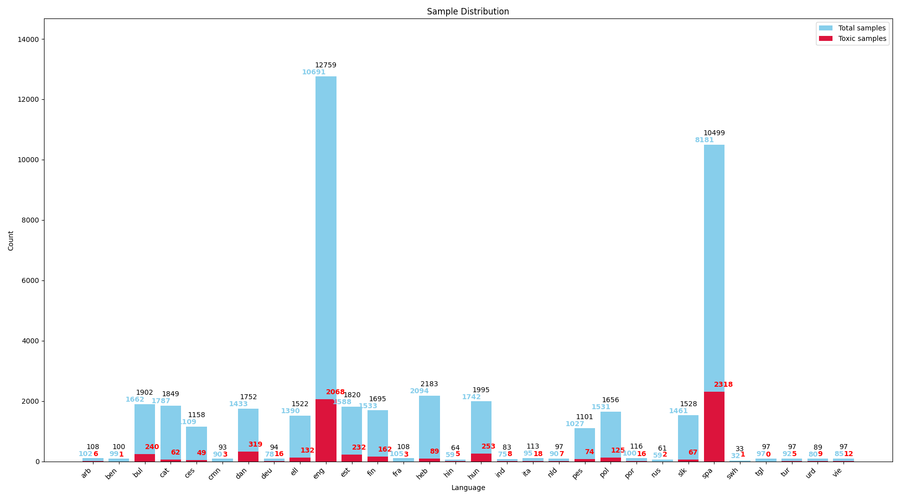
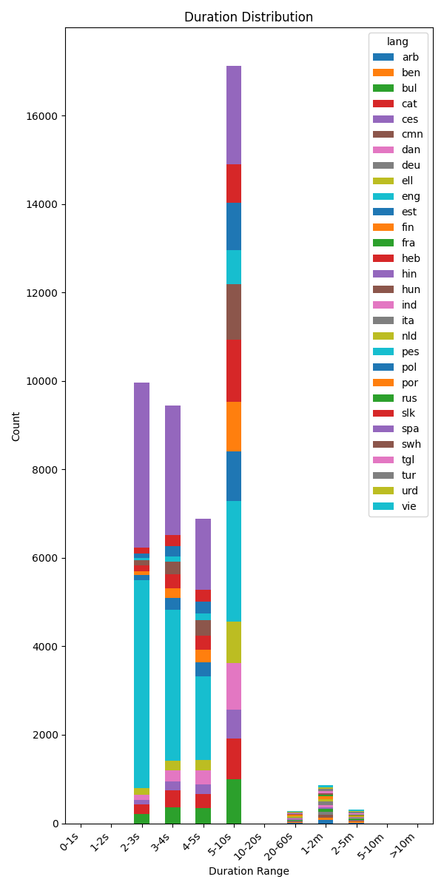

# MuTox-Hate-Speech-Detection

This project aims to detect hate speech in audio using models trained on the MuTox dataset. The MuTox dataset is a multilingual dataset of toxic speech, and this project explores various machine learning models to identify and classify hate speech within audio recordings.


## Understanding `utils.py`

The `utils.py` script is responsible for downloading and cleaning the waveform data from the `mutox.tsv` file. It processes the dataset to prepare it for model training and evaluation.

**Key Functions:**

*   `get_mutox_init()`: This function performs an initial cleaning of the raw `mutox.tsv` data. It removes rows that have undefined toxicity labels or are missing audio transcripts. The cleaned data is saved to `mutox_init.tsv`.
*   `get_job_params()`: For each row in the dataset, this function prepares the necessary parameters for downloading the audio segment. This includes extracting the URL, start time, duration, and output path for the waveform.
*   `get_waveform()`: This function handles the actual download of an individual audio segment using `ffmpeg`. It takes the parameters generated by `get_job_params()` as input. Successful downloads are logged in `mutox_clean.tsv`, while any failures (e.g., corrupted files, ffmpeg errors) are recorded in `mutox_fails.tsv`. The downloaded audio is saved as a `.wav` file.
*   `get_mutox_clean()`: This function orchestrates the entire waveform extraction process. It reads from `mutox_init.tsv`, uses `get_job_params()` to prepare download tasks, and then employs multiprocessing with `get_waveform()` to download multiple audio files in parallel, improving efficiency.

**Input File:**

*   `mutox.tsv`: The original, raw dataset file containing metadata about the audio segments, including URLs, transcripts, and toxicity labels.

**Output Files:**

*   `mutox_init.tsv`: An intermediate TSV file created after the initial cleaning step by `get_mutox_init()`. It contains entries that have valid transcripts and toxicity labels.
*   `mutox_clean.tsv`: A TSV file that logs all successfully downloaded and processed audio segments. Each row corresponds to an audio file in the `waveforms/` directory.
*   `mutox_fails.tsv`: A TSV file that records any entries from `mutox_init.tsv` that could not be successfully downloaded or processed. This includes issues like `ffmpeg` errors or corrupted output files.
*   `waveforms/`: A directory where all the successfully downloaded `.wav` audio files are stored. Each filename typically includes the language and a unique ID.
*   `durations.png`: An image file generated by `plot_durations()` showing the distribution of audio durations in the cleaned dataset.
*   `distribution.png`: An image file generated by `get_counts()` showing the distribution of samples by language and toxicity in the cleaned dataset.

## Understanding `dataset.py`

The `dataset.py` script is crucial for bridging the gap between the downloaded and cleaned audio data and a PyTorch-based machine learning model. Its primary purpose is to prepare the data in a format suitable for training and evaluation using PyTorch's `Dataset` and `DataLoader` utilities.

**Key Components:**

*   **`MuTox` Class (subclass of `torch.utils.data.Dataset`):**
    *   **Purpose:** This class is the core of the data preparation pipeline. It loads metadata from `mutox_clean.tsv` and provides a standardized way to access individual data samples (audio waveform and corresponding information).
    *   **Initialization (`__init__`):**
        *   Reads `mutox_clean.tsv` into a pandas DataFrame.
        *   Filters the DataFrame based on the specified `partition` argument (e.g., "train", "dev", "devtest"), allowing for different datasets for training, validation, and testing.
        *   Optionally filters the DataFrame by language (`lang` argument) if a specific language dataset is required.
        *   Sets a `target_n_samples` (defaulting to 5 seconds at 16kHz) for uniform audio length.
    *   **Data Retrieval (`__getitem__`):**
        *   Given an index, it fetches the corresponding row from the filtered DataFrame.
        *   Constructs the path to the audio waveform file in the `waveforms/` directory.
        *   Loads the audio file using `torchaudio.load()`.
        *   Calls `format_wav()` to process the audio.
        *   Returns a dictionary containing the audio waveform (`wav`), transcript (`text`), toxicity label (`is_toxic`), language (`lang`), and ID (`id`).
        *   Includes basic error handling for cases where an audio file might be problematic.
    *   **Audio Formatting (`format_wav`):**
        *   Ensures all audio data conforms to a specific format:
            *   **Resampling:** If the original sample rate (`sr`) of the audio file is different from the target sample rate (`SR`, defined as 16000 Hz), it resamples the audio.
            *   **Padding/Trimming:** It standardizes the length of the audio waveforms. If a waveform is shorter than `target_n_samples`, it's padded (typically with zeros). If it's longer, it's trimmed to `target_n_samples`. This is essential for batching variable-length sequences in most neural network models.

*   **`get_loader` Function:**
    *   **Purpose:** This is a convenience function that simplifies the creation of a PyTorch `DataLoader`.
    *   **Functionality:**
        *   It instantiates the `MuTox` dataset with the provided `partition` and `lang`.
        *   It then wraps the `MuTox` dataset instance with a `DataLoader`, passing along arguments like `batch_size`, `shuffle` (to randomize data order, typically for training), `num_workers` (for parallel data loading), and `pin_memory` (for potentially faster data transfer to GPU).
    *   **Output:** Returns a `DataLoader` object ready to be used in a PyTorch training or evaluation loop.

## Understanding `main.py`

The `main.py` script serves as a utility and example hub for loading and working with pre-trained MuTox and Sonar models. It simplifies the process of fetching these models and setting them up for inference or further fine-tuning.

**Initial Setup:**

At the beginning of the script, there's some initial setup:
*   `fairseq2.setup_fairseq2()`: This line initializes the Fairseq2 library, which is a dependency for the Sonar models.
*   **Device Selection:** The script automatically detects if a CUDA-enabled GPU is available. If so, it sets the `device` to `"cuda:0"` and `dtype` (data type) to `torch.float16` (for faster computation on compatible GPUs). Otherwise, it defaults to CPU (`"cpu"`) and `torch.float32`.

**Key Functions:**

*   **`load_mutox_model(model_name: str, device=None, dtype=None) -> MutoxClassifier`:**
    *   **Purpose:** Loads a pre-trained MuTox classifier model.
    *   **Functionality:** It takes a `model_name` (e.g., `"sonar_mutox"`), retrieves the MuTox model hub using `get_mutox_model_hub()` from `sonar.models.mutox`, and loads the specified model. The model is then moved to the specified `device` and its parameters are cast to the given `dtype`.
    *   **Returns:** An instance of `sonar.models.mutox.model.MutoxClassifier`.

*   **`load_sonar_model(model_name: str, device=None, dtype=None) -> SonarSpeechEncoderModel`:**
    *   **Purpose:** Loads a pre-trained Sonar speech encoder model.
    *   **Functionality:** It takes a `model_name` (e.g., `"sonar_speech_encoder_eng"` for English, `"sonar_speech_encoder_arb"` for Arabic), retrieves the Sonar speech encoder model hub using `get_sonar_speech_encoder_hub()` from `sonar.models.sonar_speech`, and loads the specified model. The model is then moved to the `device` and cast to `dtype`.
    *   **Returns:** An instance of `sonar.models.sonar_speech.model.SonarSpeechEncoderModel`.

**`MuToxClassifier` Wrapper Class:**

The script also defines a local class named `MuToxClassifier`.
*   **Purpose:** This class demonstrates how to create a combined model pipeline using a Sonar speech encoder and a MuTox classifier.
*   **Initialization (`__init__`):** When an instance of this class is created (e.g., `MuToxClassifier(lang='eng')`), it:
    1.  Loads a language-specific Sonar speech encoder using `load_sonar_model(f'sonar_speech_encoder_{lang}')`.
    2.  Loads the general MuTox classifier model using `load_mutox_model(model_name='sonar_mutox')`.
*   **Forward Pass (`__call__`):** When the instance is called like a function (e.g., `model_pipeline(audio_input)`), it first passes the input audio `x` through the loaded Sonar encoder and then feeds the resulting embeddings into the MuTox classifier model to get a toxicity prediction.

This structure in `main.py` provides a convenient way to quickly load and experiment with the MuTox hate speech detection models.

## Dependencies

The `requirements.txt` file lists all the Python packages necessary to run this project. These dependencies include libraries like PyTorch, fairseq2, pandas, and others required for data processing, model training, and interaction with the Sonar and MuTox models.

Python 3.10.17

To install these dependencies, navigate to the root directory of the project in your terminal and run the following command:

```bash
pip install -r requirements.txt
```

It's recommended to do this within a virtual environment to avoid conflicts with other Python projects or your system-wide Python installation.

## Data Visualizations

The `utils.py` script generates a couple of plots to help understand the characteristics of the cleaned MuTox dataset. These plots are saved in the `figs/` directory.

### Sample Distribution



*Figure 1: Distribution of audio samples per language in the `mutox_clean.tsv` dataset. The light blue bars represent the total number of samples for each language, while the crimson bars indicate the subset of those samples labeled as toxic.*

This visualization helps in understanding the language balance and the prevalence of toxic content across different languages in the dataset.

### Duration Distribution



*Figure 2: Distribution of audio sample durations, categorized by language. Durations are binned into several categories (e.g., 0-1s, 1-2s, ..., >10m), and the stacked bars show the count of samples in each duration bin for each language.*

This plot provides insights into the typical length of audio segments in the dataset, which can be useful for setting parameters in sequence models or for identifying if further filtering by duration is needed.
